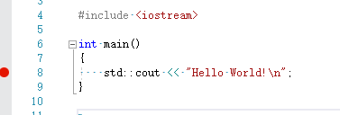
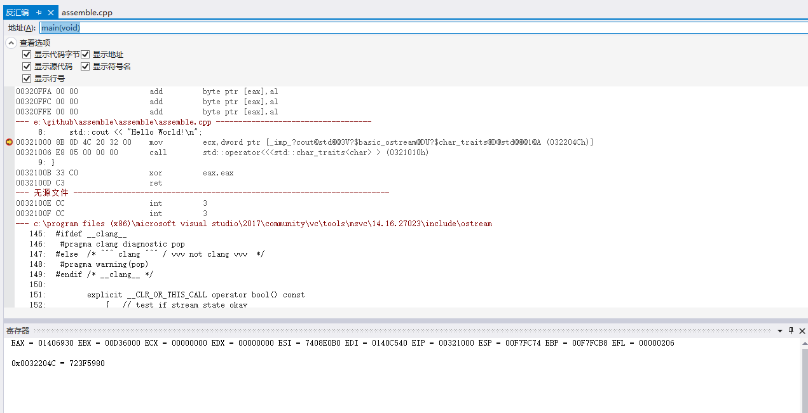
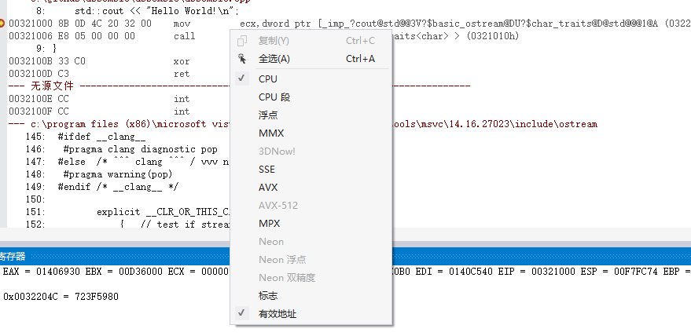
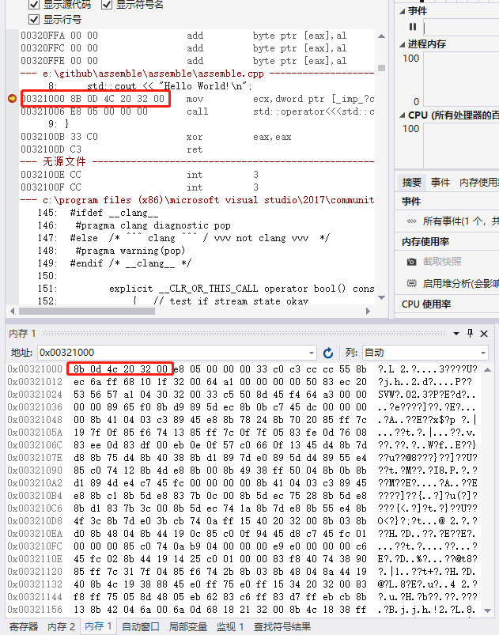
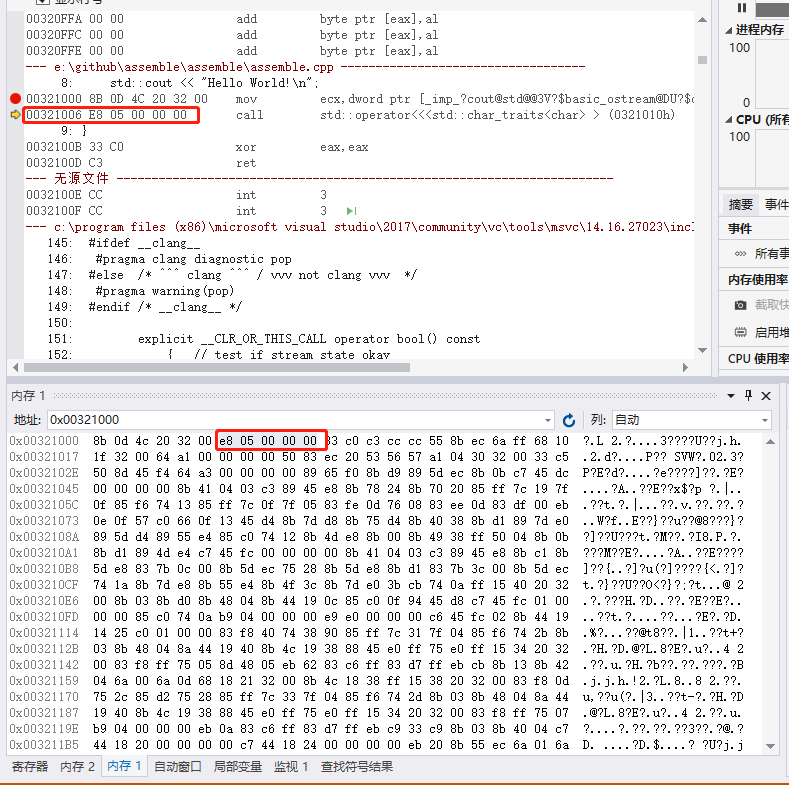
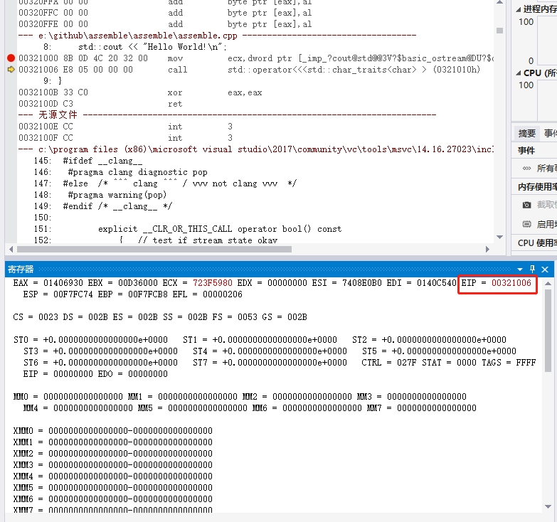
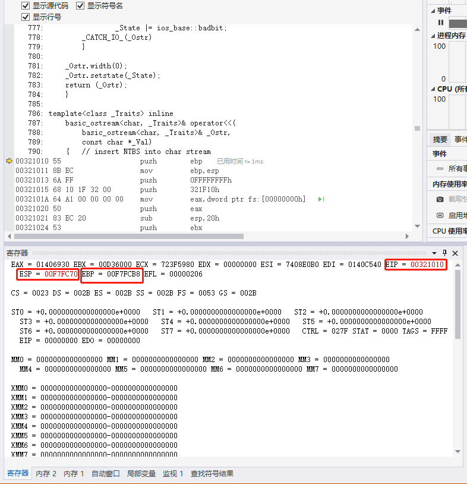
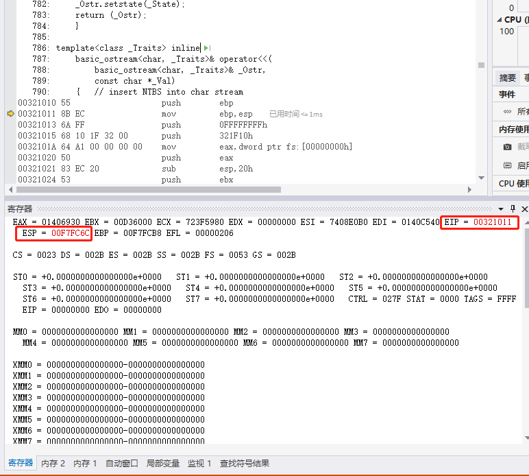
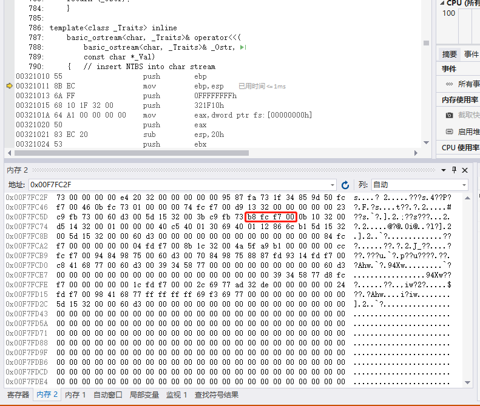

# __汇编实践__

## __如何理解栈帧__

__WINDOWS篇__

先从一个简单的程序开始，设置断点

执行F5，查看反汇编窗口

我们勾选了 显示代码字节，地址，源代码，符号名以及行号，在下面我们主要观察寄存器和内存，下面我们会在调试的过程中了解我们的寄存器是如何变化的，以及里面的值意义。

我们先看一下寄存器的值
EAX - 返回值
EBX
ECX
EDX
ESI
EDI
EIP ：下一条要执行的指令所在的地址
ESP 
EBP
EFL

除了这些基本的寄存器之外，我们还可以看各种CPU独有的寄存器，在寄存器窗口右键

这些寄存器的值，我们后面再讨论。

先看EIP，我们知道EIP里面存的是指令地址，随着程序的执行，EIP是不停变化的（是不停增长吗？）

从上面的截图我们看到EIP是00321000，我们可以从内存窗口看到这块内存的数据

上下对照红框就会发现，EIP指向的地址确实是存储要执行的下一条指令。如果在一个反汇编工具没办法直观地看，我们可以通过EIP自己计算要执行的指令（关于二进制如何翻译成指令又是一件非常复杂的事情）

下面我们F11

 

发现EIP也随着更新了，地址里存的也是指令，这就完全对上了，我们还发现ECX也更新了（后面讨论）

接着F11

我们首先发现EIP更新了，但地址不是我们预想的那样从 0x0032100b而是直接跳到0x32001010。

ESP也更新了 00F7FC74  -> 00F7FC70

我们知道堆栈的结构是高地址代表栈顶，入栈则从高地址往低地址移动，出栈则从低地址到高地址移动。

00F7FC74 : d5
00F7FC73 : 00
00F7FC72 : 32
00F7FC71 : 10

F11

此时EBP = 00F7FCB8

push ebp 

ESP update 00F7FC70  -> 00F7FC6C

我们看下ESP移动了4个字节，这四个字节刚好保存了EBP的值

这时候发现为什么会夹着一个 0b？ 

如果照结果论，那么栈顶地址其实是不包含在堆栈中的，也就是说上面LINE 62开始的定位是错的，应该是

00F7FC73 : 00
00F7FC72 : 32
00F7FC71 : 10
00F7FC70 : 0b

那么0032100b代表着什么？ 这正好是入栈之前 EIP本该在的位置，也就是我们上面所说的“我们首先发现EIP更新了，但地址不是我们预想的那样从 0x0032100b而是直接跳到0x32001010。”
从0032100b到00321010 存储的数据是 ccccc3c0（这代表什么？）

mov ebp, esp

[关于EBP](https://practicalmalwareanalysis.com/2012/04/03/all-about-ebp/)

EBP保存的是当前函数栈的base pointer，ESP会随着

